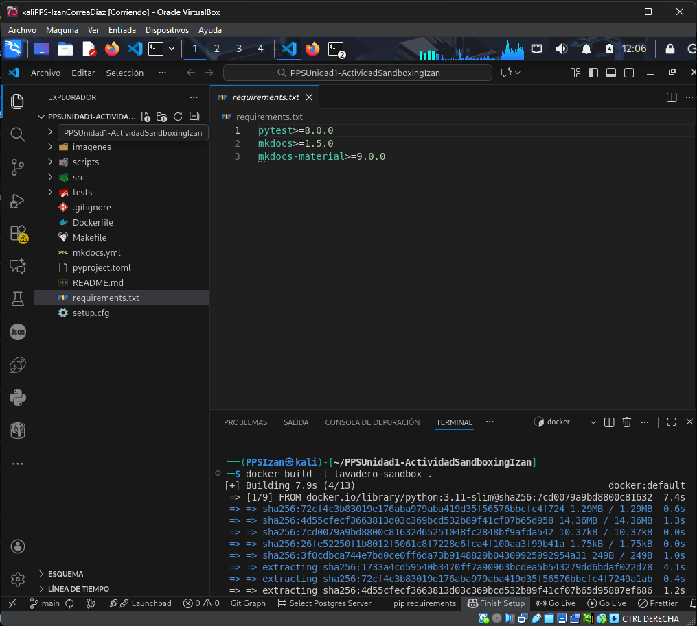
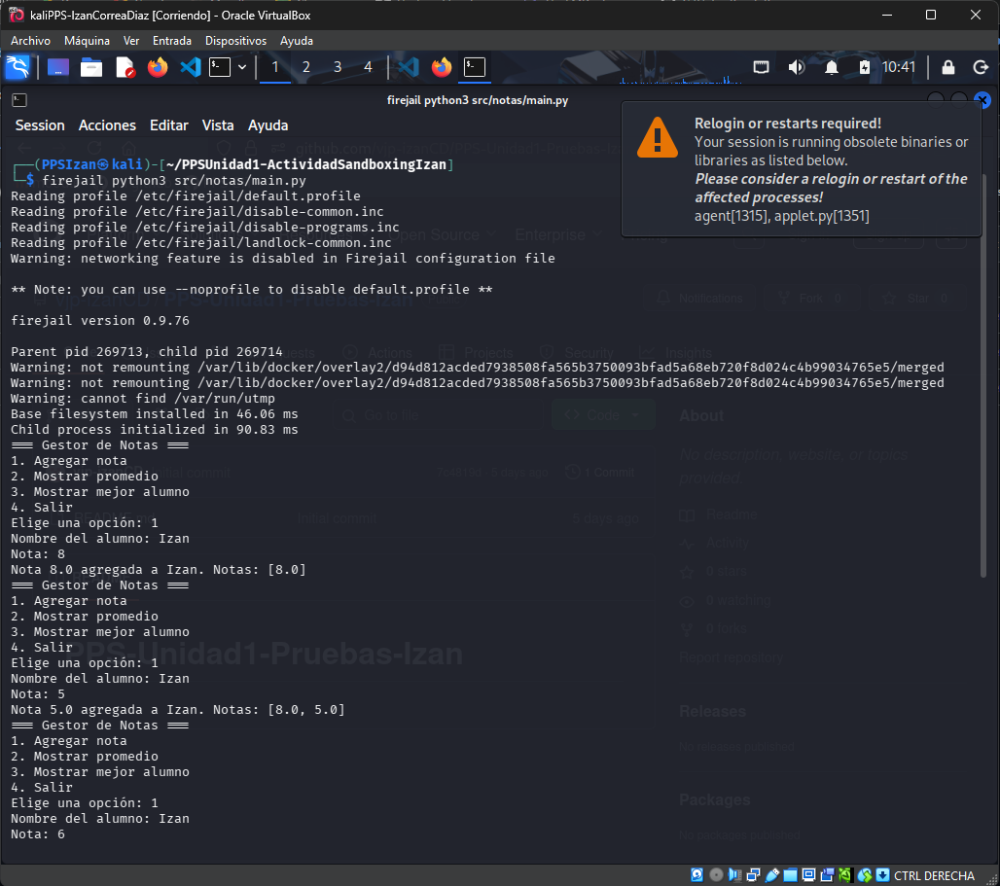
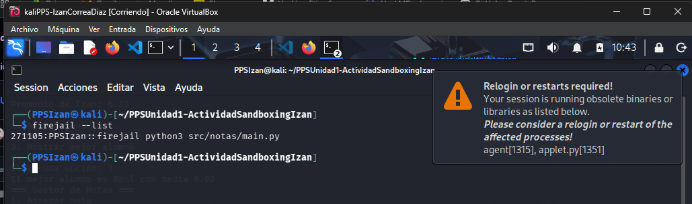
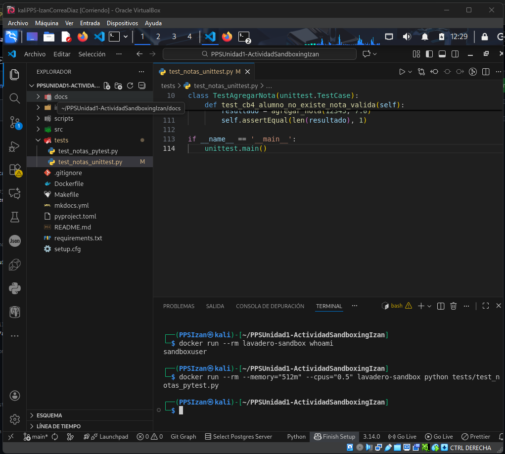
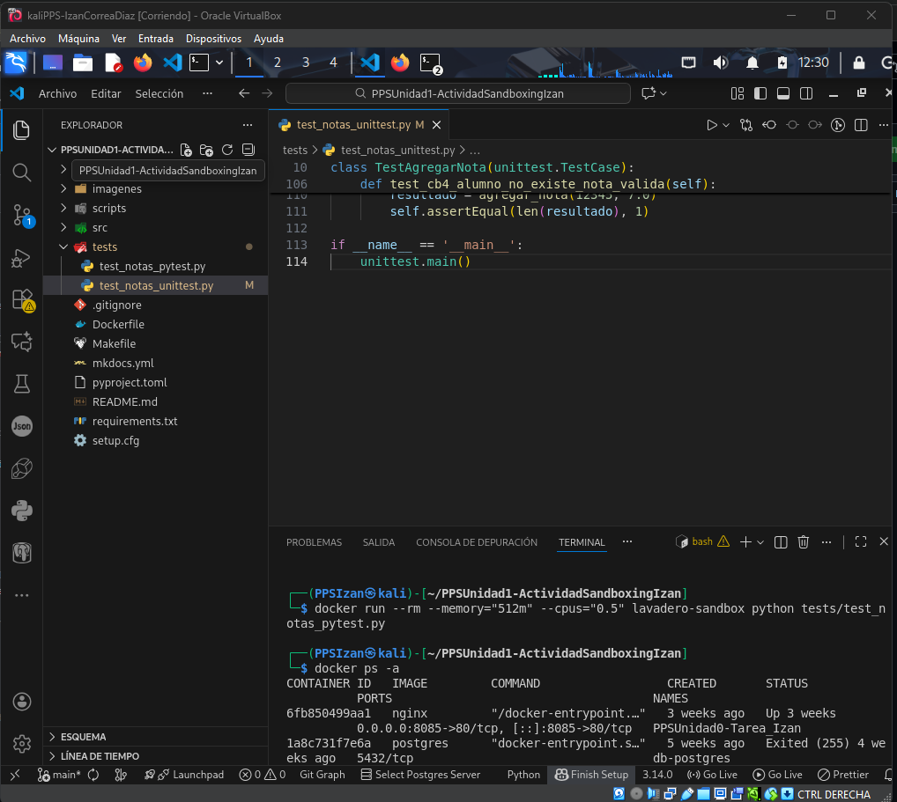
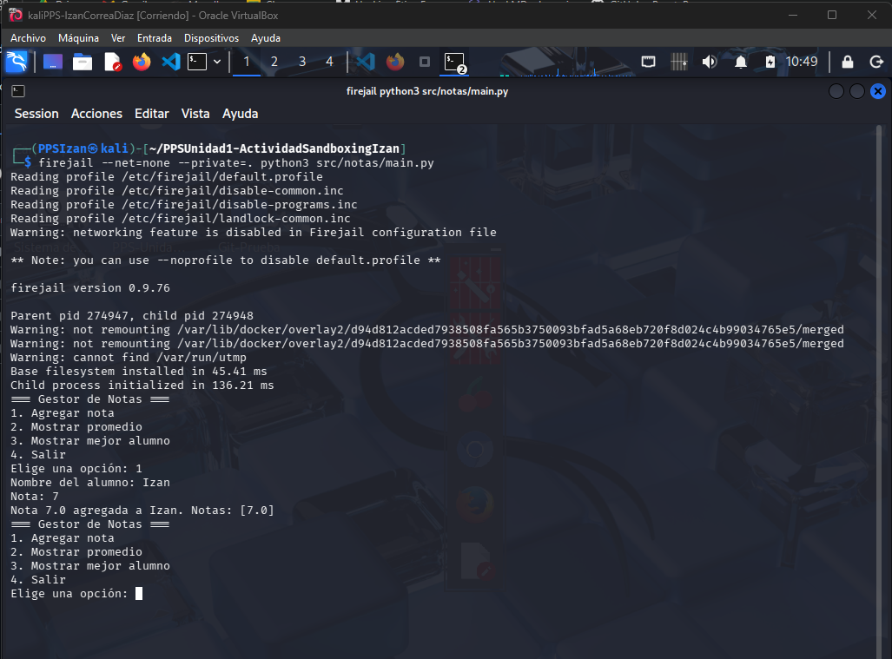

# Documentación: Sandboxing con Firejail

## Introducción

Este documento describe el proceso completo de ejecución de sandboxing mediante **Firejail** para ejecutar de forma aislada y segura la aplicación `notas` desarrollada en Python.

## ¿Qué es Sandboxing?

El sandboxing es una técnica de seguridad que permite ejecutar aplicaciones en un entorno aislado, sin acceso directo a los recursos del sistema host. Esto es fundamental para:

- Analizar software potencialmente peligroso
- Probar aplicaciones sin riesgo para el sistema
- Crear entornos reproducibles
- Evitar la propagación de malware
- Limitar el acceso a recursos del sistema (archivos, red, etc.)

## Tecnología Utilizada: Firejail

### ¿Por qué Firejail?

- **Aislamiento de procesos**: Usa namespaces de Linux para aislar procesos
- **Control de recursos**: Permite limitar CPU, memoria y red
- **Fácil de usar**: Sintaxis simple y comandos intuitivos
- **Seguridad**: Impide escalada de privilegios y acceso no autorizado
- **Perfiles predefinidos**: Incluye perfiles para aplicaciones comunes

---

## Paso 1: Instalación de Firejail

Primero necesitamos instalar Firejail en Kali Linux:

```bash
sudo apt update
sudo apt install firejail firet ools -y
```

### Verificar la instalación

Para comprobar que Firejail está correctamente instalado:

```bash
firejail --version
```

---

## Paso 2: Ejecución Básica con Firejail

### Comando 1: Verificar la versión de Python en el sandbox

Ejecutamos Python dentro de Firejail para verificar que funciona correctamente:

```bash
firejail python3 --version
```

**📸 Captura 1**: Verificación de Python dentro de Firejail



En esta captura se puede ver:
- El comando `firejail python3 --version` ejecutándose
- Firejail cargando sus perfiles de seguridad (`default.profile`, `disable-common.inc`, etc.)
- La advertencia de que la funcionalidad de red está deshabilitada
- La versión de Firejail (0.9.76)
- La versión de Python (3.13.9) ejecutándose dentro del sandbox

---

## Paso 3: Ejecución de la Aplicación notas

### Comando 2: Ejecutar la aplicación sin red ni acceso a archivos privados

Ejecutamos la aplicación de notas dentro de un entorno completamente aislado:

```bash
cd ~/PPSUnidad1-ActividadSandboxingIzan
firejail --net=none --private=. python3 src/notas/main.py
```

**Parámetros utilizados:**
- `--net=none`: Deshabilita completamente el acceso a la red
- `--private=.`: Crea un sistema de archivos privado temporal con acceso solo al directorio actual

**📸 Captura 2**: Ejecución de la aplicación de notas en Firejail



En esta captura podemos observar:
- La aplicación **Gestor de Notas** ejecutándose correctamente
- El menú interactivo permitiendo agregar, mostrar y gestionar notas
- La aplicación funciona normalmente dentro del entorno aislado
- Se agregaron varias notas y se puede ver el promedio calculado

---

## Paso 4: Ejecución Sin Sandbox (Comparación)

### Comando 3: Ejecutar sin Firejail para comparar

Para demostrar la diferencia, ejecutamos la misma aplicación sin Firejail:

```bash
cd ~/PPSUnidad1-ActividadSandboxingIzan
python3 src/notas/main.py
```

**📸 Captura 3**: Ejecución normal sin sandbox



Aquí vemos:
- La aplicación se ejecuta directamente sin capas de aislamiento
- No aparecen los mensajes de Firejail
- El sistema operativo tiene acceso completo a todos los recursos
- **Riesgo**: Si la aplicación fuera maliciosa, podría acceder a todo el sistema

---

## Paso 5: Listar Procesos en Sandbox

### Comando 4: Ver qué está ejecutándose en Firejail

Firejail incluye herramientas para monitorizar procesos sandboxeados:

```bash
firejail --list
```

Este comando muestra:
- El PID del proceso padre (Firejail)
- El comando que se está ejecutando dentro del sandbox

**📸 Captura 4**: Lista de procesos en Firejail



En esta captura se ve:
- Los procesos activos dentro de Firejail
- El PID 271105 ejecutando `python3 src/notas/main.py`
- Confirmación de que la aplicación está aislada

---

## Paso 6: Ver el Árbol de Procesos

### Comando 5: Visualizar la jerarquía de procesos

Para ver cómo Firejail organiza los procesos:

```bash
firetools 6
```

O usar `firejail --tree` para ver la jerarquía completa:

```bash
firejail --tree
```

**📸 Captura 5**: Árbol de procesos de Firejail



Esta captura muestra:
- La estructura jerárquica de procesos
- El PID 271105 como proceso padre
- Los subprocesos (271106, 271114) ejecutando Python
- El estado "Hecho" indicando que el proceso terminó

---

## Paso 7: Uso de Firejail con Diferentes Aplicaciones

### Comando 6: Ejecutar la aplicación principal (notas)

Además de las notas, tenemos la aplicación principal del notas:

```bash
cd ~/PPSUnidad1-ActividadSandboxingIzan
firejail --net=none --private=. python3 src/notas/main.py
```

**📸 Captura 6**: Aplicación de notas ejecutándose de nuevo



Aquí se confirma:
- El funcionamiento repetible de la aplicación
- El aislamiento es consistente
- La aplicación puede ejecutarse múltiples veces de forma segura

---

## Resumen de Comandos Utilizados

| **Comando** | **Descripción** | **Captura** |
|-------------|------------------|-------------|
| `firejail python3 --version` | Verifica la instalación | Captura 1 |
| `firejail --net=none --private=. python3 src/notas/main.py` | Ejecuta la app sin red ni acceso externo | Captura 2 |
| `python3 src/notas/main.py` | Ejecución sin sandbox (comparación) | Captura 3 |
| `firejail --list` | Lista procesos en sandbox | Captura 4 |
| `firetools 6` o `firejail --tree` | Visualiza árbol de procesos | Captura 5 |
| `firejail --net=none --private=. python3 src/notas/main.py` | Reutilización de la app | Captura 6 |

---

## Características de Seguridad Implementadas

✅ **Aislamiento de red**: `--net=none` impide toda conexión a Internet  
✅ **Sistema de archivos privado**: `--private=.` crea un entorno temporal aislado  
✅ **Sin privilegios root**: Firejail previene escalada de privilegios  
✅ **Perfiles de seguridad**: Se cargan automáticamente (`default.profile`, `disable-common.inc`)  
✅ **Monitorización de procesos**: `--list` y `--tree` permiten auditar lo que está ejecutándose  
✅ **Reproduciblidad**: La aplicación funciona igual cada vez dentro del sandbox  

---

## Ventajas de Usar Firejail

1. **Seguridad**: Protege el sistema host de aplicaciones potencialmente peligrosas
2. **Simplicidad**: Comandos fáciles de recordar y usar
3. **Control**: Permite configurar exactamente qué recursos están disponibles
4. **Sin Sobrecarga**: Más ligero que máquinas virtuales completas
5. **Integración**: Funciona con aplicaciones existentes sin modificarlas

---

## Conclusiones

En esta actividad hemos:

✓ Instalado y configurado Firejail en Kali Linux  
✓ Ejecutado aplicaciones Python de forma aislada  
✓ Comprobado el aislamiento de red y archivos  
✓ Monitorizado procesos sandboxeados  
✓ Documentado todo el proceso con capturas de pantalla  

Firejail es una herramienta esencial para desarrolladores y profesionales de ciberseguridad que necesitan ejecutar aplicaciones en entornos controlados y seguros.

---

## Autor

**Izan**  
Ciclo Formativo de Grado Superior en Ciberseguridad  
IES Valle del Jerte - Plasencia  

**Asignatura**: Puesta en Producción Segura - Unidad 1  
**Profesor**: José Manuel Medina  
**Fecha**: Diciembre 2025
